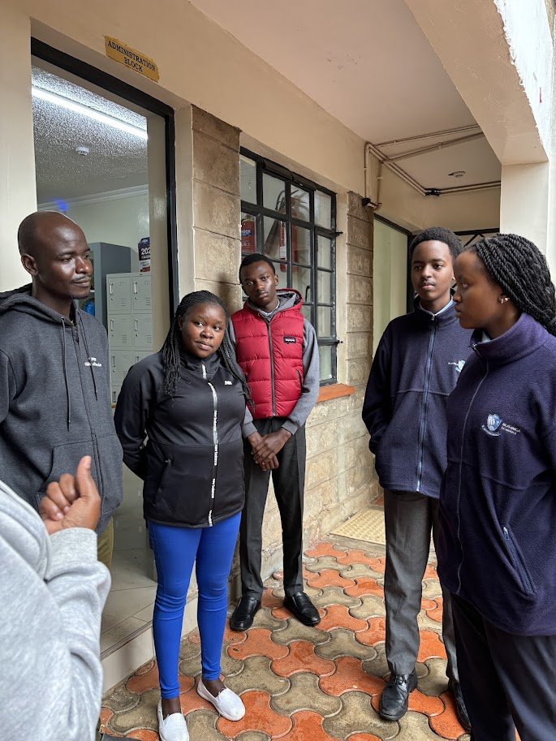
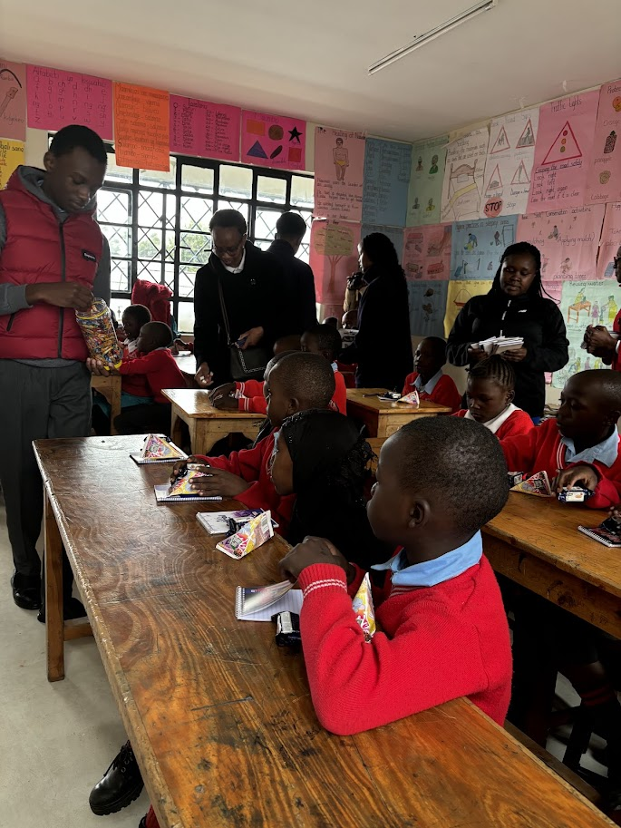

# 📸 How to Add Images to the Impact Page

This guide will walk you through adding images to the "Our Impact" section of your Edussentials website.

## Quick Overview

The Impact page displays a gallery of images showing your organization's work and impact. Currently, there are 5 images displayed. You can easily add more or replace existing ones.

## 📁 Current Structure

Your website already has an `images` folder with the following files:
- `IMG_1922.jpg` - Supporting education in our community
- `IMG_1985.jpg` - Connecting with schools and students
- `IMG_1987.jpg` - Building stronger educational communities
- `IMG_2011.jpg` - Making a difference in children's lives
- `Screenshot 2026-01-28 222401.png` - Documenting our progress

## 🚀 Step-by-Step Guide

### Step 1: Prepare Your Images

1. **Choose your images**: Select high-quality photos that showcase your organization's impact
2. **Optimize file size**: 
   - Recommended: Under 500KB per image
   - Format: JPG or PNG
   - Resolution: At least 800px wide
3. **Rename files**: Use descriptive names (e.g., `classroom-visit-2024.jpg`)

### Step 2: Add Images to the Folder

1. Navigate to your repository folder
2. Open the `images` folder
3. Copy your new image files into this folder

**Example:**
```bash
# If you're using command line:
cp /path/to/your/photo.jpg /path/to/Eddussentials/images/
```

### Step 3: Update index.html

Open `index.html` in a text editor and find the Impact section (around line 181-212).

#### To ADD a new image:

Add this code block inside the `<div class="impact-gallery">` section:

```html
<div class="impact-item">
    
    <p class="impact-caption">Your caption text here</p>
</div>
```

**Example:**
```html
<div class="impact-item">
    
    <p class="impact-caption">Visiting local schools to assess needs</p>
</div>
```

#### To REPLACE an existing image:

Find the image you want to replace and change the `src` attribute:

**Before:**
```html

```

**After:**
```html

```

### Step 4: Update the Caption

Change the caption text to describe your new image:

```html
<p class="impact-caption">Your new caption describing the image</p>
```

### Step 5: Save and Test

1. Save the `index.html` file
2. Open `index.html` in a web browser to preview
3. Scroll down to the "Our Impact" section to see your changes
4. Verify that all images load correctly

## 📝 Complete Example

Here's a complete example showing the entire impact section with a new image added:

```html
<section id="impact" class="impact">
    <div class="container">
        <h2 class="section-title">Our Impact</h2>
        <p class="section-subtitle">Making a Difference in Young Lives</p>
        
        <div class="impact-gallery">
            <!-- Existing Image 1 -->
            <div class="impact-item">
                
                <p class="impact-caption">Supporting education in our community</p>
            </div>
            
            <!-- Existing Image 2 -->
            <div class="impact-item">
                
                <p class="impact-caption">Connecting with schools and students</p>
            </div>
            
            <!-- NEW IMAGE - Add your new image here! -->
            <div class="impact-item">
                
                <p class="impact-caption">Your caption here</p>
            </div>
            
            <!-- More existing images... -->
        </div>
    </div>
</section>
```

## 🎨 Best Practices

### Image Guidelines:
- ✅ Use high-quality, clear photos
- ✅ Ensure proper lighting and composition
- ✅ Show real activities and impact
- ✅ Get proper consent for photos with people (especially children)

### Alt Text Guidelines:
- ✅ Describe what's in the image
- ✅ Be concise but descriptive
- ✅ Start with "Educational impact -"
- ✅ Help visually impaired users understand the content

### Caption Guidelines:
- ✅ Keep it brief (1-2 sentences)
- ✅ Explain the significance or context
- ✅ Use active, engaging language

## 🔧 Troubleshooting

### Image not showing?
1. **Check the file path**: Make sure the path is `images/filename.jpg`
2. **Check the file name**: Ensure it matches exactly (case-sensitive)
3. **Check the file location**: Image must be in the `images` folder
4. **Check file extension**: Must be `.jpg`, `.jpeg`, or `.png`

### Image too large or small?
The CSS automatically handles sizing, but if you need adjustments:
- Images are set to `object-fit: cover` which crops them to fill the space
- Standard height is 250px
- Width is responsive (100% of container)

### Image stretched or distorted?
The `object-fit: cover` CSS property should prevent this. If issues persist:
1. Use images with similar aspect ratios
2. Recommended ratio: 4:3 or 16:9
3. Make sure images are at least 800px wide

## 📱 Responsive Design

The impact gallery is responsive and will automatically adjust:
- **Desktop**: Multiple columns
- **Tablet**: 2 columns
- **Mobile**: Single column

No additional code needed - it's all handled by the CSS!

## 🚀 Quick Checklist

Before you commit your changes:

- [ ] Images are optimized (under 500KB each)
- [ ] Images are in the `images` folder
- [ ] File names are descriptive (no spaces)
- [ ] `src` attributes in HTML match file names exactly
- [ ] Alt text is descriptive and meaningful
- [ ] Captions are clear and engaging
- [ ] Tested in browser (images load correctly)
- [ ] You have permission to use all photos

## 💡 Tips

- **Consistency**: Try to use images with similar styles/quality
- **Variety**: Show different aspects of your work
- **Story**: Order images to tell a story of your impact
- **Update regularly**: Keep adding new images as your work progresses
- **Privacy**: Always blur faces or get consent for identifiable photos of children

## 🆘 Need More Help?

- Check the main [README.md](README.md) for general information
- See [QUICK_START.md](QUICK_START.md) for website basics
- The website uses standard HTML/CSS - any web development tutorial can help
- File an issue on GitHub if you encounter problems

---

**Happy documenting your impact! 🌟**
